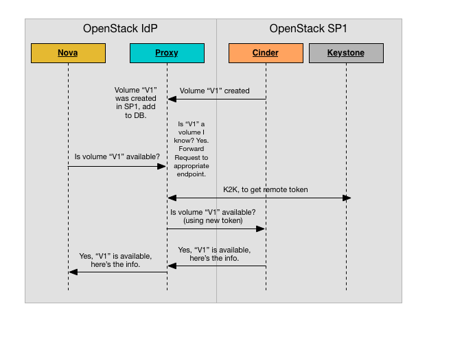
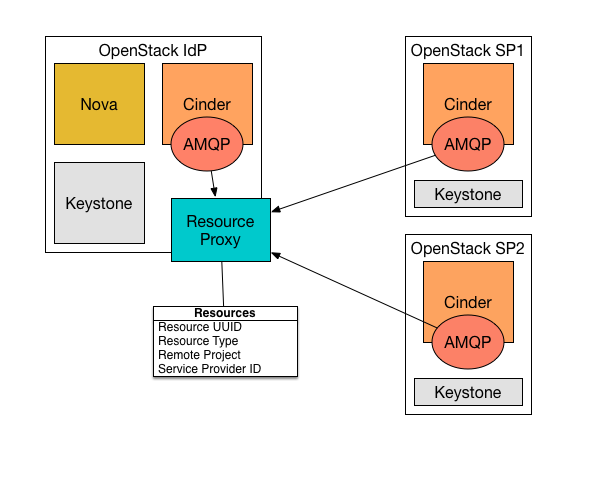

============
Architecture
============

The proxy is designed to substitute an endpoint in the service catalog.
When a user/service requests the proxied service for a specific resource
(volume, image, etc), the proxy will analyze the URL of the request to
figure out the type of the resource and the UUID of the resource and '
forward the request to the correct service provider, getting a token through
K2K and using that for the remote endpoint. It will then forward the response
back.

To gather the information about the location of the resources, the proxy listens
to the notifications message bus for messages which describe the creation of new
resources, and stores that location information into the database.

